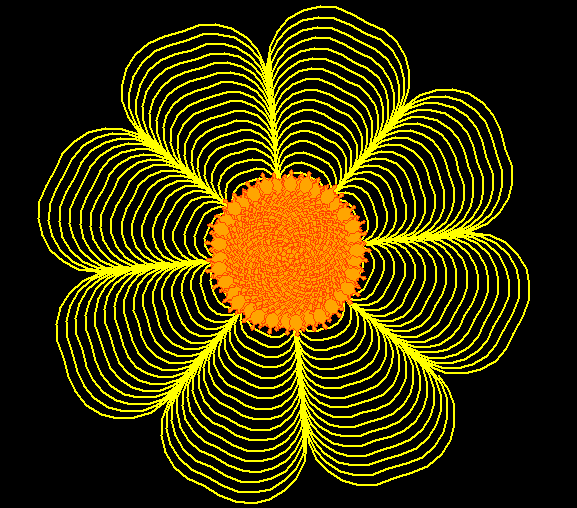

# 🌻 Flor con turtle

Este proyecto genera un dibujo visualmente atractivo de una flor utilizando la librería `turtle` en Python. La flor se dibuja de manera secuencial con trazos artísticos y precisos, además de incluir una espiral basada en el patrón de Fibonacci para darle un toque matemático y más natural



## Características

- **Dibujo de una flor amarilla** con un trazado fluido.
- **Simplicidad y elegancia** usando bucles para crear patrones repetitivos y geométricos.
- **Patrón de espiral basado en Fibonacci**, el cual agrega un aspecto armónico y natural a la composición.
- **Configuración visual personalizable**: colores, tamaño de los patrones y velocidad de trazado.
- **Uso de `turtle` en Python** para crear gráficos en pantalla de manera simple y visualmente atractiva.

## Requisitos

- Python 3.x
- Librería `turtle` (incluida en las versiones estándar de Python)

## Uso

1. Clona este repositorio.
2. Ejecuta el archivo Python en tu entorno preferido.
   ```bash
   python flower_turtle_art.py
   ```
3. Disfruta del proceso de creación visual de una flor en la ventana gráfica.

## Personalización

- Puedes cambiar los colores, la velocidad de trazado y los ángulos de los pétalos ajustando los parámetros del código.
- Experimenta con los valores de los bucles para crear tus propios patrones geométricos.
